# Projeto CookMaster

[Link do projeto](https://arthur-jr-cookmaster.herokuapp.com/recipes)

# Contexto

Este projeto trata-se de uma API onde deverá ser possível fazer o cadastro e login de pessoas usuárias, onde essas pessoas poderão cadastrar
receitas culinária, modifica-las e deleta-las.

Para realizar qualquer tipo de alteração no banco de dados (como cadastro, edição ou exclusão de receitas) será necessário autenticar-se.
Além disso, as pessoas usuárias devem estar cadastrada.
Pessoas cadastrada apenas poderão disparar ações nas receitas que ele mesmo criou.
Já uma pessoa administradora pode disparar qualquer ação em qualquer receita.

## Técnologias usadas

Back-end:

> Desenvolvido usando: NodeJS, ExpressJS, MongoDB, ES6, JWT, MOCHA/CHAI/SINON(teste de integração), bcrypt.

## Instalando Dependências

É necessário utilizar o [Insomnia](https://insomnia.rest/download) ou [Postman](https://www.postman.com/)
para fazer requisições de qualquer tipo diferente do GET.

> Backend

Na raiz do projeto:
```bash
npm install
``` 
## Executando aplicação

* Para rodar o back-end:

  Na raiz do projeto:

  ```
  npm run start
  ```

## Executando Testes

* Para rodar todos os testes:

  ```
    npm test
    npm test:coverage
  ```
  
 ## End-Points
 
 * O que é necessário para fazer requisições e sua respostas:
 
  O end-point (GET /recipes)
  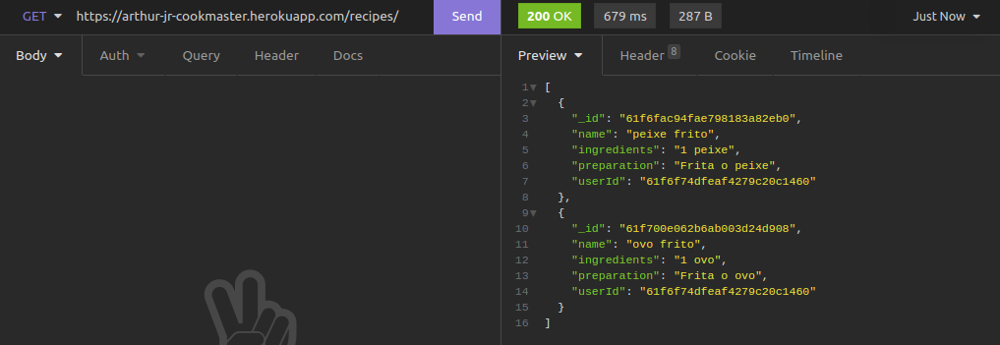
  
  O end-point (GET /recipes/:id)
  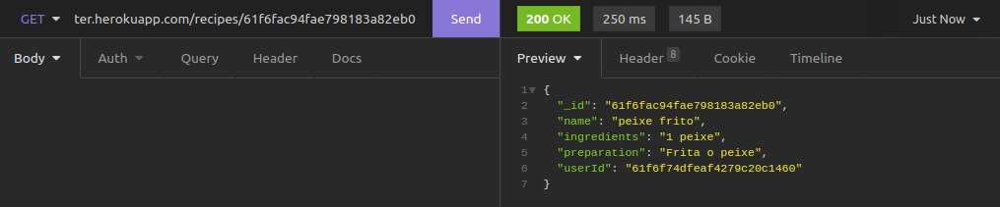
  
  O end-point (POST /users)
  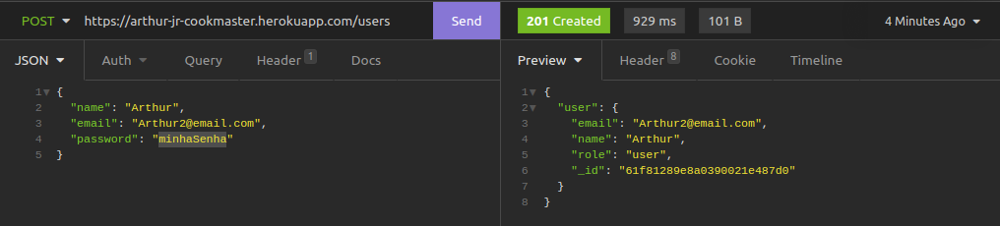

  O end-point (POST /login)
  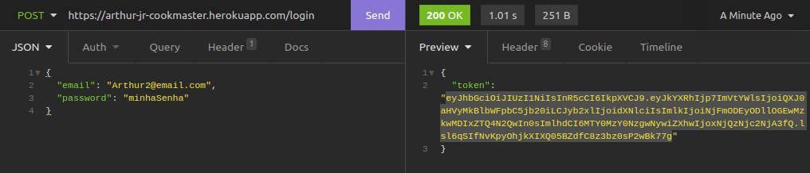
  
  O end-point (POST /recipes)
  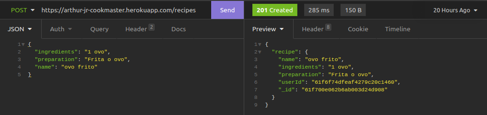
  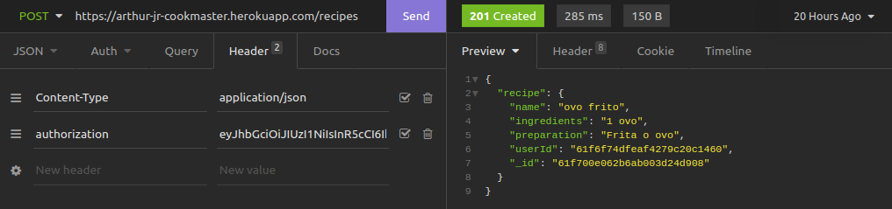
  
  O end-point (PUT /recipes/:id)
  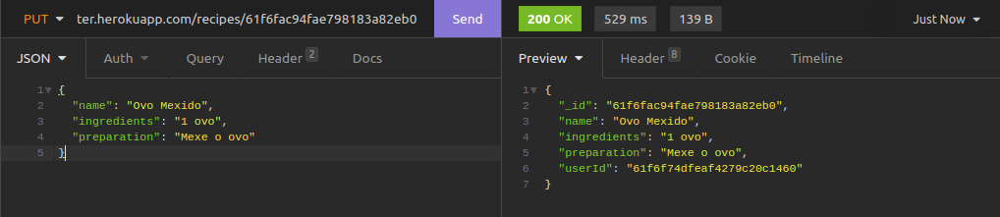
  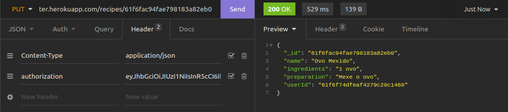
  
  O end-point (DELETE /recipes/:id)
  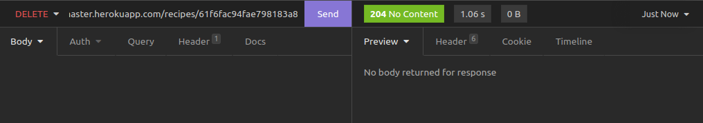
  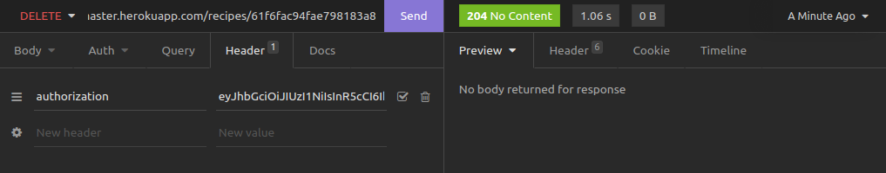
  
  O end-point (PUT /recipes/:id/image)
  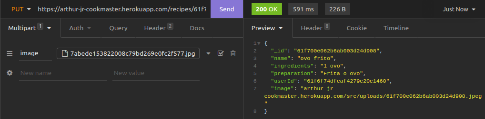
  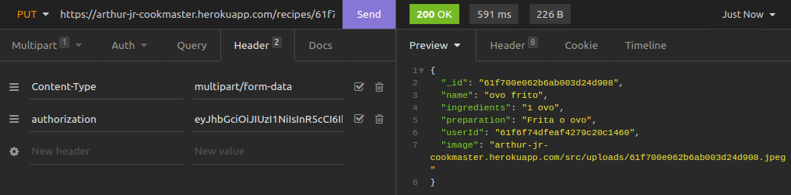
  
  O end-point (GET /images/:id.jpeg)
  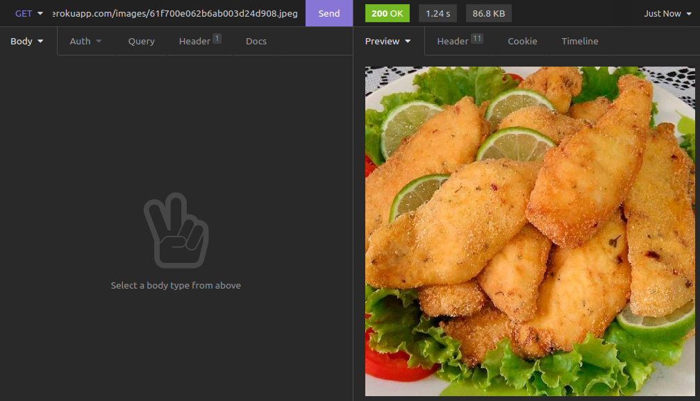
  
